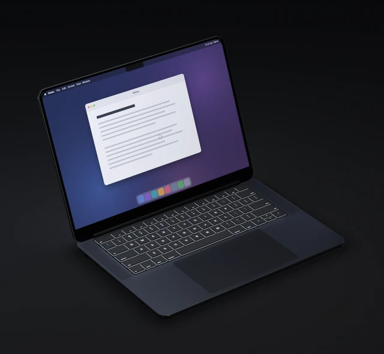

<h1 align="center">Dimmer</h1>
<p align="center">Your MacBook's keyboard backlight and screen dim as you close the lid, and are off before it shuts.</p>
<p align="center">
  <a href="https://github.com/kalkman-code/dimmer/releases/latest"></a>
  <a href="LICENSE"></a>
  
</p>

<p align="center"></p>

<p align="center">
  <a href="https://github.com/kalkman-code/dimmer/releases/download/v1.2.1/Dimmer-1.2.1.dmg"><b>Download Dimmer 1.2.1</b></a><br>
  macOS 14 or later · signed and notarised by Apple · free, GPL-3.0 · <a href="https://github.com/kalkman-code/dimmer/releases/tag/v1.2.1">release notes</a>
</p>

Dimmer is a small menu bar app. It reads the lid angle from the MacBook's hinge sensor and sets the
keyboard backlight and screen from it, on ranges you set yourself.

## What it does

- Fades the keyboard and screen from full with the lid at 100 degrees to off at 68 by default. Drag or type each end's angle and brightness in Settings, or switch either off.
- Puts your brightness back when you open the lid, pause or quit, and the keyboard backlight when the Mac sleeps, automatic keyboard brightness included.
- Press Ctrl+Cmd+P in any app and every screen frosts over until you type, touch the trackpad or lift the lid. Snap to blur, off by default, does the same when you snap the lid down quickly.
- Go dark fades the keyboard and screen off without moving the lid; Keep awake holds the Mac awake on a timer or indefinitely. Both are in the menu bar panel.
- Steps aside when you change the keyboard brightness yourself, and leaves the keyboard dark when macOS has dimmed it for inactivity.
- VoiceOver can read and set every value, the axis ends move with the arrow keys, and Reduce Motion and Reduce Transparency are respected.

## Requirements

- macOS 14 or later, on a MacBook with a lid-angle sensor. Without one, the panel says "Built-in lid angle sensor is unavailable." and Dimmer dims nothing.
- Tested on one machine: a 16-inch MacBook Pro with M1 Max (2021) on macOS 27.2.
- The app is universal, but Intel is untested. Only an Intel MacBook with the hinge sensor can work, reportedly the 2019 16-inch MacBook Pro onwards. A bug report saying whether it worked is welcome either way.

Dimmer relies on interfaces Apple does not document, so a macOS update can break it without notice. [How it works](HOW-IT-WORKS.md) lists them.

## Privacy

Dimmer asks for no Accessibility, Input Monitoring or Screen Recording permission, makes no network
connections, and has no account or telemetry. It notices typing and the trackpad from macOS's idle
counters, which say only that input happened, and the blur is a standard frosted layer, not a
capture of your screen. Only Launch at Login may need you to allow it in System Settings.

## Languages

English, Spanish, Portuguese, German, French and Japanese, following your Mac's language.

## Install

1. Download [`Dimmer-1.2.1.dmg`](https://github.com/kalkman-code/dimmer/releases/download/v1.2.1/Dimmer-1.2.1.dmg).
2. Open it and drag Dimmer to Applications.
3. Open Dimmer. Its icon, a diamond cut across by a line, appears in the menu bar: click it for the panel, right-click for Settings, Go dark, About, Pause and Quit. The diamond turns to an outline while paused. The first time, Settings opens with a short welcome and offers Launch at Login.

To check the download, compare `shasum -a 256 Dimmer-1.2.1.dmg` with
[`SHA256SUMS`](https://github.com/kalkman-code/dimmer/releases/download/v1.2.1/SHA256SUMS) on the release.

## Uninstall

The panel's More → Uninstall Dimmer… walks you through it. In short: turn off Launch at Login in
Settings, wake the keyboard with a key or the trackpad, choose Quit Dimmer so it puts your
brightness back, then move Dimmer from Applications to the Bin.

Optional leftovers, once it has quit with brightness restored:
`~/Library/Preferences/uk.co.kalkmancode.Dimmer.plist`,
`~/Library/Application Support/Dimmer/keyboard-recovery.json` and
`~/Library/Application Support/Dimmer/display-recovery.json`; the Application Support folder can go too if it is then empty. If brightness did not come back, keep
the recovery files and reopen Dimmer with the keyboard awake before trying again.

## Build from source

You need a release (not beta) Xcode 16 or later, for the Swift 6 tools.

```sh
git clone https://github.com/kalkman-code/dimmer.git
cd dimmer
scripts/build-app.sh
open build/Dimmer.app
```

`scripts/build-app.sh` builds the release binary and assembles an ad hoc signed `build/Dimmer.app`.
`swift test` runs the tests.

## Contributing and bug reports

Forks and pull requests are welcome. To report a bug, use the
[bug report form](https://github.com/kalkman-code/dimmer/issues/new?template=bug_report.yml).
About Dimmer, in the menu bar icon's right-click menu, shows your version, build, macOS and Mac
model, with a button that copies them; the form asks for those and what the panel shows.

## Licence

GPL-3.0. See [LICENSE](LICENSE). Dimmer is not affiliated with or endorsed by Apple.

The privacy shortcut uses [KeyboardShortcuts](https://github.com/sindresorhus/KeyboardShortcuts)
by Sindre Sorhus, under the MIT licence. Its notice is included in the app's resources.

The angles, the privacy veil, recovery, settings carried over from earlier versions and the
private interfaces Dimmer uses are in [How it works](HOW-IT-WORKS.md).
